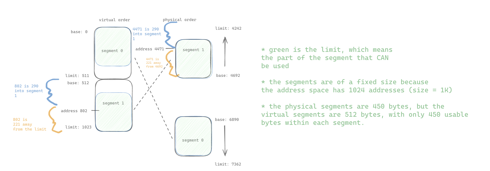
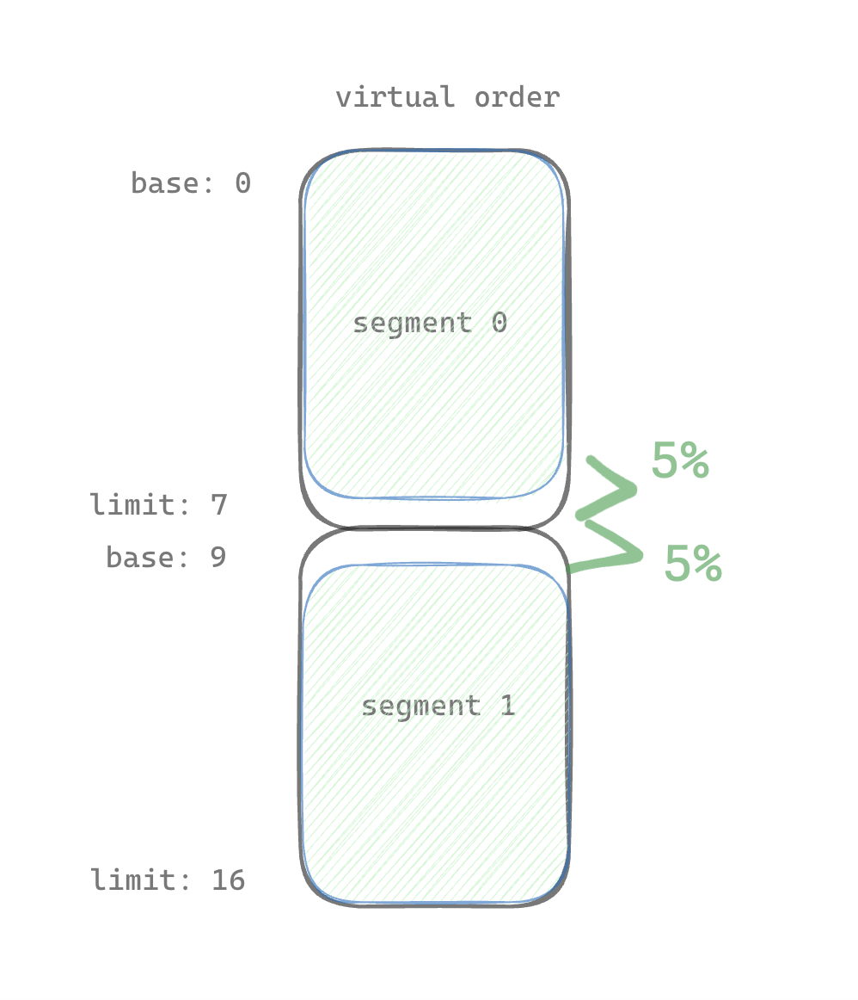

# README notes

I experienced some confusion when reading the README.

First of all, in the README example (`./segmentation.py`), this is the output:

```
ARG seed 0
ARG address space size 1k
ARG phys mem size 16k

Segment register information:

  Segment 0 base  (grows positive) : 0x00001aea (decimal 6890)
  Segment 0 limit                  : 472

  Segment 1 base  (grows negative) : 0x00001254 (decimal 4692)
  Segment 1 limit                  : 450

Virtual Address Trace
  VA  0: 0x0000020b (decimal:  523) --> PA or segmentation violation?
  VA  1: 0x0000019e (decimal:  414) --> PA or segmentation violation?
  VA  2: 0x00000322 (decimal:  802) --> PA or segmentation violation?
  VA  3: 0x00000136 (decimal:  310) --> PA or segmentation violation?
  VA  4: 0x000001e8 (decimal:  488) --> PA or segmentation violation?

For each virtual address, either write down the physical address it translates to
OR write down that it is an out-of-bounds address (a segmentation violation). For
this problem, you should assume a simple address space with two segments: the top
bit of the virtual address can thus be used to check whether the virtual address
is in segment 0 (topbit=0) or segment 1 (topbit=1). Note that the base/limit pairs
given to you grow in different directions, depending on the segment, i.e., segment 0
grows in the positive direction, whereas segment 1 in the negative.
```

How do I know which of these is in segment 0 or 1? Well, I realized I needed to translate the hex numbers to binary numbers and then examine the most significant bit (the left-most bit, or the top bit). How many digits will the binary number have? Notice the top of this output says "ARG address space size 1k". I think this means the entire usable address space is 1K, which translates to a 10-bit binary number. That means there is one bit that denotes the segment, and 9 bits that denote the address. Therefore, each segment can have up to 512 addresses. I think this makes sense? The limits are both under 512. Anyway, I am going to translate each of these addresses into 10-bit binary numbers. Oh, I didn't use anything fancy, by the way, just this: https://www.inchcalculator.com/hex-to-binary-converter/. If it spits out a 9-digit number, you can pad it with a leading 0.

Virtual Address Trace
VA 0: 0x0000020b (decimal: 523) (binary: 1000001011) --> segment violation
VA 1: 0x0000019e (decimal: 414) (binary: 0110011110) --> ???
VA 2: 0x00000322 (decimal: 802) (binary: 1100100010) --> PA or segmentation violation?
VA 3: 0x00000136 (decimal: 310) (binary: 0100110110) --> PA or segmentation violation?
VA 4: 0x000001e8 (decimal: 488) (binary: 0111101000) --> PA or segmentation violation?

Then I got stuck translating VA1 to a physical address. After a lot of thinking, I figured out why I was confused, and came up with this diagram:



See, the virtual address space is larger than the physical address space. The virtual address space is limited by the physical space (obviously).

Maybe I missed the part of the book where there is a reason why segments are of a fixed size? This reminds me of what I read in later chapters about pages.

# Questions

1. First let's use a tiny address space to translate some addresses. Here's a simple set of parameters with a few different random seeds; can you translate the addresses?
   - `./segmentation.py -a 128 -p 512 -b 0 -l 20 -B 512 -L 20 -s 0`
     - VA 0: 0x0000006c (decimal: 108)(binary: 1101100) --> SEG1: 492
     - VA 1: 0x00000061 (decimal: 97) (binary: 1100001) --> SEG1: segmentation violation
     - VA 2: 0x00000035 (decimal: 53) (binary: 0110101) --> SEG0: segmentation violation
     - VA 3: 0x00000021 (decimal: 33) (binary: 0100001) --> SEG0: segmentation violation
     - VA 4: 0x00000041 (decimal: 65) (binary: 1000001) --> SEG1: segmentation violation
   - `./segmentation.py -a 128 -p 512 -b 0 -l 20 -B 512 -L 20 -s 1`
     - VA 0: 0x00000011 (decimal: 17) (binary: 0010001) --> SEG0: 17
     - VA 1: 0x0000006c (decimal: 108)(binary: 1101100) --> SEG1: 492
     - VA 2: 0x00000061 (decimal: 97) (binary: 1100001) --> SEG1: segmentation violation
     - VA 3: 0x00000020 (decimal: 32) (binary: 0100000) --> SEG0: segmentation violation
     - VA 4: 0x0000003f (decimal: 63) (binary: 0111111) --> SEG0: segmentation violation
   - `./segmentation.py -a 128 -p 512 -b 0 -l 20 -B 512 -L 20 -s 2`
     - VA 0: 0x0000007a (decimal: 122)(binary: 1111010) --> SEG1: 506
     - VA 1: 0x00000079 (decimal: 121) (binary: 1111001) --> SEG1: 505
     - VA 2: 0x00000007 (decimal: 7) (binary: 0000111) --> SEG0: 7
     - VA 3: 0x0000000a (decimal: 10) (binary: 0001010) --> SEG0: 10
     - VA 4: 0x0000006a (decimal: 106) (binary: 1101010)--> SEG1: segmentation violation (490 is illegal)
2. Now, let's see if we understand this tiny address space we've constructed (using the parameters from the question above).
   - What is the highest legal virtual address in segment 0? 19 because the address starts at 0 and goes to 19 since the max number of addresses is 20.
   - What about the lowest legal virtual address in segment 1? 108 because the address space starts at 128 and goes backwards by 20.
   - What are the lowest and highest illegal addresses in this entire address space? In the virtual address space, the lowest illegal address is 20, and the highest illegal address is 107.
   - Finally, how would you run `segmentation.py` with the `-A` flag to test if you are right?
     - `./segmentation.py -a 128 -p 512 -b 0 -l 20 -B 512 -L 20 -s 2 -A $decimalAddress -c`
3. Let's say we have a tiny 16-byte address space in a 128-byte physical memory. What base and bounds would you set up so as to get the simulator to generate the following translation results for the specified address stream: valid, valid, violation, ..., violation, valid, valid? Assume the following parameters: `./segmentation.py -a 16 -p 128 -A 0,1,2,3,4,5,6,7,8,9,10,11,12,13,14,15 --b0 0 --l0 2 --b1 128 --l1 2`
4. Assuming we want to generate a problem where roughly 90% of the randomly-generated virtual addresses are valid (i.e. not segmentation violations). How should you configure the simulator to do so? Which parameters are important?

   - Answer: The number of legal addresses should cover 90% of the address space size. You can accomplish this by making s0's limit should take up 95% of virtual_address_size/2, and s1's limit should take up 95% of virtual_address_size/2 as well. You would also want to make sure that the base/bounds for s0 and s2 starts at the top/bottom of the physical address space, respectively. I visualized it below. You could configure it like this: `./segmentation.py -a 100 -p 128 -A 0,1,2,3,4,5,6,7,8,9,10,11,12,13,14,15,16,17,18,19,20,21,22,23,24,25,26,27,28,29,30,31,32,33,34,35,36,37,38,39,40,41,42,43,44,45,46,47,48,49,50,51,52,53,54,55,56,57,58,59,60,61,62,63,64,65,66,67,68,69,70,71,72,73,74,75,76,77,78,79,80,81,82,83,84,85,86,87,88,89,90,91,92,93,94,95,96,97,98,99 --b0 0 --l0 45 --b1 128 --l1 45`. I tested it and it works. Yay!

     

5. Can you run the simulator such that no virtual addresses are valid? How?
   `./segmentation.py -a 16 -p 128 -A 0,1,2,3,4,5,6,7,8,9,10,11,12,13,14,15 --b0 0 --l0 0 --b1 128 --l1 0`
