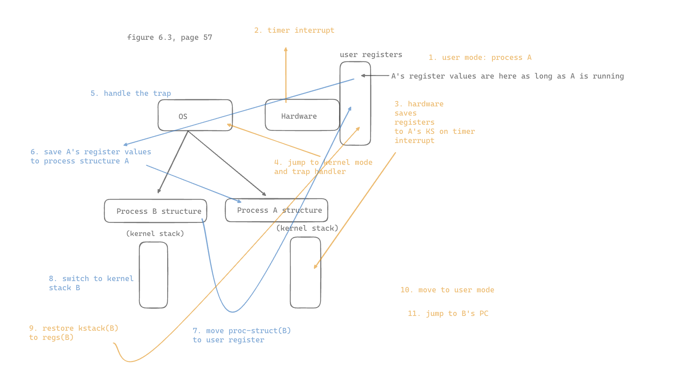
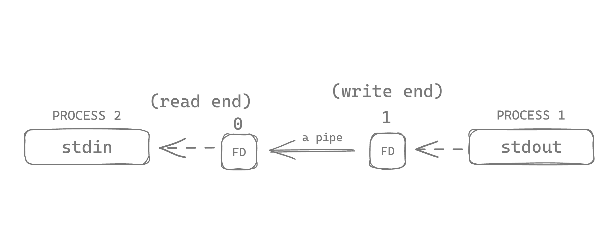
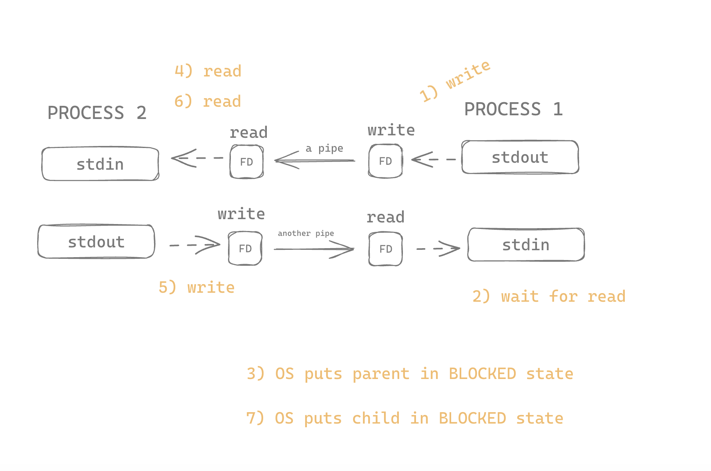

# How switches work

I wanted to make a diagram of how this works. This drawing is from page 57, figure 6.3.

# Homework

# Part 1

First I need to call `gettimeofday`. I looked at the man pages and asked Catharine some questions which helped. It looks like the synposis section's syntax is definitely C.

`gettimeofday(struct timeval *restrict tp, void *restrict tzp);`

- `struct timeval *restrict tp`
  - `struct timeval`: a structure that represents an elapsed time.
  - `*restrict`: the `*` is a pointer declaration, and `restrict` is a keyword that can be used with pointer declarations. It indicates to the compiler that, for the lifetime of this pointer, no other pointer will reference the memory that it points to. This allows the compiler to make optimizations.
  - `tp`: the name of the parameter.
- `void *restrict tzp`
  - `void`: means "nothing" or "no type".
  - `*restrict`: an exclusive pointer.
  - `tzp`: the name of the parameter.

# Part 2

I think I am meant to replicate `lmbench` by using pipes. Here is how it works.

1. Runs two processes on a single CPU (I will need to use something like `sched_setaffinity` to accomplish this on my machine).
2. Set up two pipes between both of them.
3. P1 issues a WRITE to pipe1.
4. P1 waits for a READ on pipe2.
5. OS notices P1 is waiting for a READ, so it puts P1 in the BLOCKED state.
6. OS switches to P2.
7. P2 reads from pipe1.
8. P2 writes to pipe2.

## Get pipe to work between two processes

To learn more about `pipe` system calls, I ran `man 2 pipe`.

From that, I drew this picture:

Also this is how using two pipes work between two processes:

And the function signature:
`pipe(int fildes[2]);`

- `int fildes[2]`: an array of 2 integers, where each integer represents a file descriptor.

I will need two file descriptors: one on each end of the pipe.

To do this, I looked up `man 2 open`. This is what I found as the function signature:

`open(const char *path, int oflag, ...);`

Explanation:

- `const char *path`: this confused me. `const char` is a single character, and `*path` is a pointer to a variable called `path`. I was confused how you could pass in something like "file.txt" to this param position if "file.txt" is a series of characters, not just one character. It turns out that in C, a string is just a pointer to the FIRST character in a series of characters.
- `int oflag`: this is a flag you can pass in to modify how `open` behaves.

### Question: are file descriptors shared between processes?

File descriptors are generally unique to each process, but they can be shared by child processes created with a fork subroutine or copied by the fcntl, dup, and dup2 subroutines.
