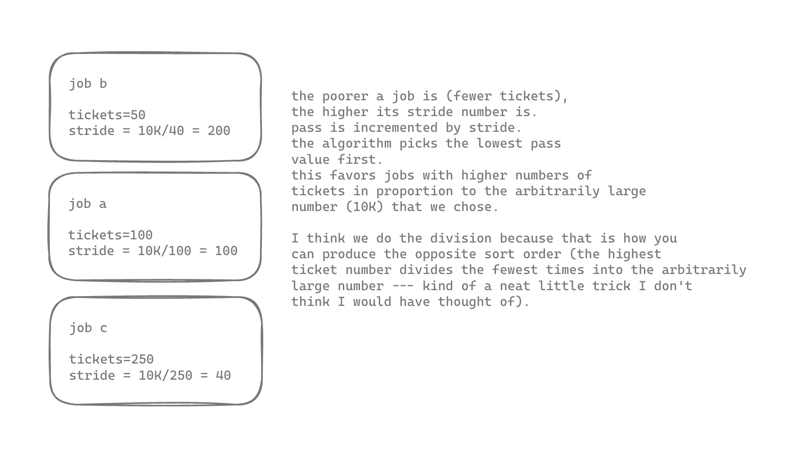

# Homework questions

1. About what I expected
2. What I expected -- job 0 will rarely be able to run before job 1.
3. The biggest time gap I saw was 20 (180 to 200).
4. If the quantum (time slice) increases, I think the gap between the first and second job to finish will widen. Result: my hypothesis was correct!
